# The Elements

Preview of individually linked project cards. Each card opens its repository.

<a href="https://github.com/Builder106/ocaml-limit" title="OCaml Limit"><picture><source media="(prefers-color-scheme: dark)" srcset="preview-cards/01-oc-dark.svg"><source media="(prefers-color-scheme: light)" srcset="preview-cards/01-oc-light.svg"></picture></a>
<a href="https://github.com/Builder106/qforge" title="qforge"><picture><source media="(prefers-color-scheme: dark)" srcset="preview-cards/02-c-dark.svg"><source media="(prefers-color-scheme: light)" srcset="preview-cards/02-c-light.svg"></picture></a>
<a href="https://github.com/Builder106/clear-hash" title="ClearHash"><picture><source media="(prefers-color-scheme: dark)" srcset="preview-cards/03-rs-dark.svg"><source media="(prefers-color-scheme: light)" srcset="preview-cards/03-rs-light.svg"></picture></a>
<a href="https://github.com/Builder106/capitol-alpha" title="CapitolAlpha"><picture><source media="(prefers-color-scheme: dark)" srcset="preview-cards/04-py-dark.svg"><source media="(prefers-color-scheme: light)" srcset="preview-cards/04-py-light.svg"></picture></a>
<a href="https://github.com/Builder106/datafest-2026" title="datafest-2026"><picture><source media="(prefers-color-scheme: dark)" srcset="preview-cards/05-r-dark.svg"><source media="(prefers-color-scheme: light)" srcset="preview-cards/05-r-light.svg"></picture></a>
<a href="https://github.com/Builder106/econ-os" title="EconOS"><picture><source media="(prefers-color-scheme: dark)" srcset="preview-cards/06-py-dark.svg"><source media="(prefers-color-scheme: light)" srcset="preview-cards/06-py-light.svg"></picture></a>
<a href="https://github.com/Builder106/linux-bench-hub" title="LinuxBenchHub"><picture><source media="(prefers-color-scheme: dark)" srcset="preview-cards/07-rb-dark.svg"><source media="(prefers-color-scheme: light)" srcset="preview-cards/07-rb-light.svg"></picture></a>
<a href="https://github.com/Builder106/staija" title="STAIJA"><picture><source media="(prefers-color-scheme: dark)" srcset="preview-cards/08-vu-dark.svg"><source media="(prefers-color-scheme: light)" srcset="preview-cards/08-vu-light.svg"></picture></a>
<a href="https://github.com/Builder106/study-sprint" title="StudySprint"><picture><source media="(prefers-color-scheme: dark)" srcset="preview-cards/09-ts-dark.svg"><source media="(prefers-color-scheme: light)" srcset="preview-cards/09-ts-light.svg"></picture></a>
<a href="https://github.com/Builder106/micro-match" title="MicroMatch"><picture><source media="(prefers-color-scheme: dark)" srcset="preview-cards/10-sv-dark.svg"><source media="(prefers-color-scheme: light)" srcset="preview-cards/10-sv-light.svg"></picture></a>
<a href="https://github.com/Builder106/med-core" title="MedCore"><picture><source media="(prefers-color-scheme: dark)" srcset="preview-cards/11-re-dark.svg"><source media="(prefers-color-scheme: light)" srcset="preview-cards/11-re-light.svg"></picture></a>
<a href="https://github.com/Builder106/builder106.github.io" title="portfolio"><picture><source media="(prefers-color-scheme: dark)" srcset="preview-cards/12-ts-dark.svg"><source media="(prefers-color-scheme: light)" srcset="preview-cards/12-ts-light.svg"></picture></a>
<a href="https://github.com/Builder106/imc-prosperity" title="IMC Prosperity"><picture><source media="(prefers-color-scheme: dark)" srcset="preview-cards/13-py-dark.svg"><source media="(prefers-color-scheme: light)" srcset="preview-cards/13-py-light.svg"></picture></a>
<a href="https://github.com/Builder106/halberd" title="halberd"><picture><source media="(prefers-color-scheme: dark)" srcset="preview-cards/15-go-dark.svg"><source media="(prefers-color-scheme: light)" srcset="preview-cards/15-go-light.svg"></picture></a>
<a href="https://github.com/Builder106/quarry" title="quarry"><picture><source media="(prefers-color-scheme: dark)" srcset="preview-cards/16-yu-dark.svg"><source media="(prefers-color-scheme: light)" srcset="preview-cards/16-yu-light.svg"></picture></a>
<a href="https://github.com/Builder106/enclave" title="enclave"><picture><source media="(prefers-color-scheme: dark)" srcset="preview-cards/17-nx-dark.svg"><source media="(prefers-color-scheme: light)" srcset="preview-cards/17-nx-light.svg"></picture></a>
<a href="https://github.com/Builder106/helm" title="helm"><picture><source media="(prefers-color-scheme: dark)" srcset="preview-cards/18-ts-dark.svg"><source media="(prefers-color-scheme: light)" srcset="preview-cards/18-ts-light.svg"></picture></a>
<a href="https://github.com/Builder106/meta-helper" title="MetaHelper"><picture><source media="(prefers-color-scheme: dark)" srcset="preview-cards/19-kt-dark.svg"><source media="(prefers-color-scheme: light)" srcset="preview-cards/19-kt-light.svg"></picture></a>
<a href="https://github.com/Builder106/ascii-arcade" title="ASCII Arcade"><picture><source media="(prefers-color-scheme: dark)" srcset="preview-cards/20-rs-dark.svg"><source media="(prefers-color-scheme: light)" srcset="preview-cards/20-rs-light.svg"></picture></a>

Project links and demos

- [OCaml Limit](https://github.com/Builder106/ocaml-limit) — OCaml | Quant | [Demo](https://ocaml-lob.vercel.app/)
- [qforge](https://github.com/Builder106/qforge) — C99 | Quant | [Demo](https://qforge-neural.vercel.app)
- [ClearHash](https://github.com/Builder106/clear-hash) — Rust | Cybersecurity | [Demo](https://clear-hash.vercel.app)
- [CapitolAlpha](https://github.com/Builder106/capitol-alpha) — Python | Data analysis | [Demo](https://capitolalpha.vercel.app/)
- [datafest-2026](https://github.com/Builder106/datafest-2026) — R | Data analysis | [Demo](https://datafest-2026.vercel.app/)
- [EconOS](https://github.com/Builder106/econ-os) — Python | Quant | [Demo](https://econ-os.vercel.app)
- [LinuxBenchHub](https://github.com/Builder106/linux-bench-hub) — Ruby | Data analysis | [Demo](https://linuxbenchhub.vercel.app/)
- [STAIJA](https://github.com/Builder106/staija) — Vue | Software engineering | [Demo](https://staija.org)
- [StudySprint](https://github.com/Builder106/study-sprint) — TypeScript | Software engineering | [Demo](https://getstudysprint.vercel.app)
- [MicroMatch](https://github.com/Builder106/micro-match) — Svelte | Software engineering | [Demo](https://trymicromatch.vercel.app)
- [MedCore](https://github.com/Builder106/med-core) — React | Health technology | [Demo](https://medcore-health.vercel.app)
- [portfolio](https://github.com/Builder106/builder106.github.io) — TypeScript | Software engineering | [Demo](https://yinkavaughan.me/)
- [IMC Prosperity](https://github.com/Builder106/imc-prosperity) — Python | AI/ML | [Demo](https://tradetell.streamlit.app)
- [halberd](https://github.com/Builder106/halberd) — Go | Cybersecurity | [Demo](https://halberd-keep.vercel.app)
- [quarry](https://github.com/Builder106/quarry) — Yul | Cybersecurity | [Demo](https://quarry-mev.vercel.app)
- [enclave](https://github.com/Builder106/enclave) — Next.js | AI/ML | [Demo](https://enclave-iota.vercel.app)
- [helm](https://github.com/Builder106/helm) — TypeScript | AI/ML | [Demo](https://helm-bridge.vercel.app)
- [MetaHelper](https://github.com/Builder106/meta-helper) — Kotlin | Mobile
- [ASCII Arcade](https://github.com/Builder106/ascii-arcade) — Rust | Tooling

